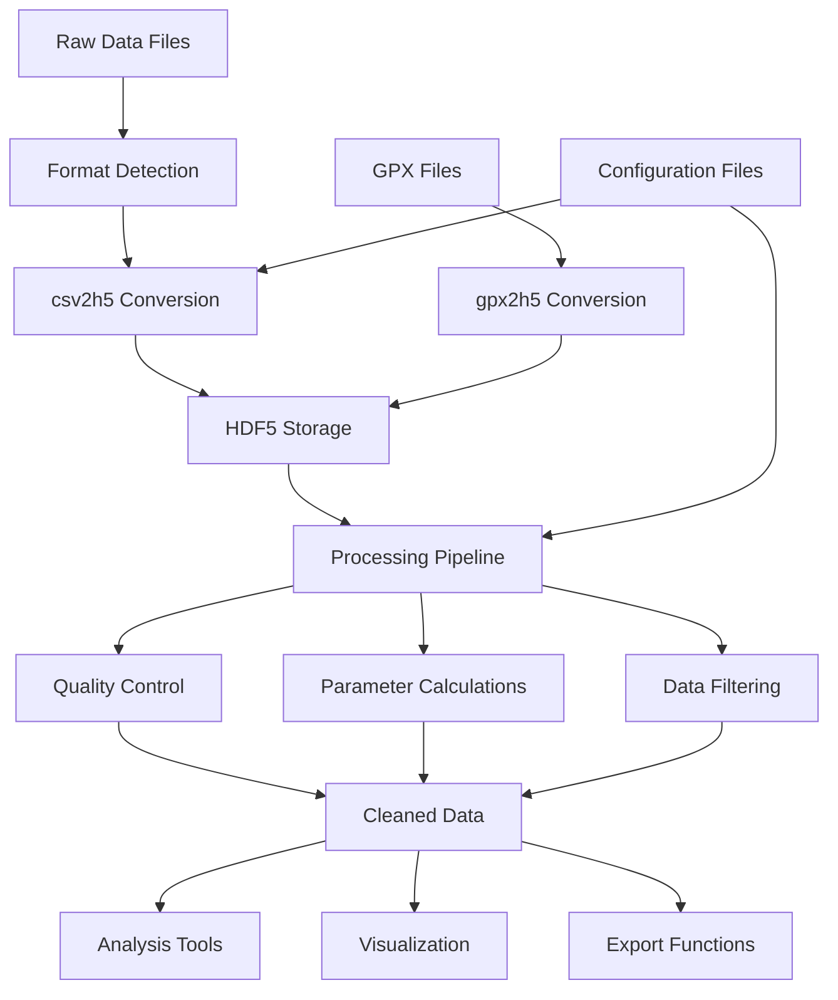

# System Architecture Documentation

## Overview

This system is designed for processing oceanographic and meteorological data from various instruments and sensors. It provides tools for converting CSV and other text-based data formats into HDF5 format for efficient storage and analysis, with support for geospatial data, time series processing, and data visualization.

## Core Components

### 1. Data Processing Pipeline

The system follows a modular pipeline architecture:

1. **Data Ingestion**: Raw data from instruments (CTD, ADCP, GPS, etc.) in various formats (CSV, TXT)
2. **Format Conversion**: `csv2h5.py` converts text formats to HDF5 using pandas/dask
3. **Data Processing**: Custom processing functions for specific instrument types
4. **Storage**: HDF5 files with structured tables and metadata
5. **Analysis/Visualization**: Tools for data extraction, processing, and visualization

### 2. Key Modules

#### csv2h5.py
The main conversion module that transforms CSV/text files into HDF5 format. Key features:
- Supports various CSV dialects and formats
- Configurable via INI files
- Uses dask for handling large files
- Implements data filtering and quality control
- Handles time zone corrections and data interpolation

#### h5.py
Core HDF5 handling module with functions for:
- Reading/writing HDF5 files
- Managing table structures and indexes
- Handling time series data
- Moving and sorting data between temporary and final storage
- Managing metadata and log tables

#### csv_specific_proc.py
Specialized processing functions for different instrument types:
- CTD (Conductivity-Temperature-Depth) sensors
- ADCP (Acoustic Doppler Current Profilers)
- GPS/navigation data
- Inclinometer data
- Meteorological sensors

#### gpx2h5.py
Converts GPX files (GPS track data) to HDF5 format for integration with other sensor data.

#### ctd_calc.py
Performs calculations on CTD data including:
- Salinity calculations using GSW (Gibbs Sea Water) library
- Density calculations
- Data filtering and quality control
- Profile extraction and analysis

## Data Flow Architecture



## Data Storage Structure

### HDF5 File Organization

The system uses HDF5 files with a hierarchical structure:

```
cruise_data.h5
├── CTD_SST_CTD90
│   ├── data table (measurements)
│   └── logRuns (metadata about profiles)
├── navigation
│   ├── waypoints
│   ├── tracks
│   └── routes
├── ADCP_data
│   ├── data table
│   └── logFiles
└── metadata
    └── processing_log
```

### Table Structures

1. **Data Tables**: Contain time-indexed measurements with columns for each parameter
2. **Log Tables**: Metadata about data segments including:
   - Time ranges (start/end)
   - File information
   - Processing status
   - Quality metrics

## Instrument Support

### CTD Sensors
- **SST (Sea & Sun Technology)**: Specialized processing for their CTD instruments
- **Idronaut**: Processing for Idronaut CTD data
- **Schuka**: Format-specific handling
- **Rock**: Processing for ROCK CTD data

### Navigation Data
- **GPX Files**: Waypoints, tracks, and routes
- **Supervisor Format**: Custom navigation data format
- **HYPACK**: Hydrographic survey data format

### Current Meters
- **ADCP**: Acoustic Doppler Current Profiler data
- **Wave Gauges**: Wave height and period data

### Other Sensors
- **Inclinometers**: Tilt and orientation data
- **Meteorological**: Weather station data

## Configuration System

### INI Files
The system uses INI configuration files to define processing parameters:

```ini
[in]
path = data/input/*.csv
header = Date(text),Time(text),Pres,Temp,Cond,Sal,O2,O2ppm,pH,Eh

[filter]
min_Pres = 0.35
min_Sal = 1

[out]
table = CTD_SST_90M
b_insert_separator = True

[program]
log = logs/processing.log
```

### Command Line Interface
Most modules support command-line arguments for flexible operation:
- Configuration file specification
- Path and file pattern definitions
- Processing parameters
- Output options

## Processing Features

### Time Handling
- Automatic time zone detection and correction
- Time interpolation for missing data
- Duplicate time handling
- Time range filtering

### Data Quality Control
- Min/max value filtering
- Spike detection and removal
- Duplicate record handling
- Data validation

### Parameter Calculations
- Seawater properties using GSW library:
  - Practical Salinity
  - Absolute Salinity
  - Conservative Temperature
  - Density (sigma0, sigma4)
  - Sound velocity
- Geographic calculations:
  - Coordinate conversions
  - Distance calculations
  - Depth calculations

### Data Visualization
- Integration with Veusz for plotting
- Profile extraction and visualization
- Time series plotting
- Section plots for transect data

## Workflow Examples

### CTD Data Processing
1. Raw CTD files → csv2h5 → HDF5 storage
2. ctd_calc → Salinity/density calculations
3. Profile extraction → Cleaned profiles
4. Veusz plotting → Visualized data products

### Navigation Data Integration
1. GPX files → gpx2h5 → Navigation tables
2. CTD data → Time interpolation to navigation data
3. Combined dataset → Georeferenced measurements

## Performance Considerations

### Large Data Handling
- Uses dask for out-of-core processing
- Chunked reading/writing for memory efficiency
- Parallel processing capabilities
- Temporary file management

### Indexing and Search
- Time-indexed tables for fast retrieval
- Full table indexing for complex queries
- Range queries for time-based filtering

## Error Handling and Logging

### Logging System
- Configurable log levels (DEBUG, INFO, WARNING, ERROR)
- File-based and console logging
- Structured error messages
- Processing progress tracking

### Error Recovery
- Temporary file management for crash recovery
- Duplicate detection and handling
- Data validation and consistency checks
- Graceful degradation for partial failures

## Extension Points

### Custom Processing Functions
- Instrument-specific processing in `csv_specific_proc.py`
- Custom filtering functions
- Specialized calculation modules

### New Format Support
- Template-based converter creation
- Format detection and routing
- Configuration-driven processing

### Integration Capabilities
- Export to CSV/Text formats
- Compatibility with scientific Python ecosystem
- Veusz integration for visualization